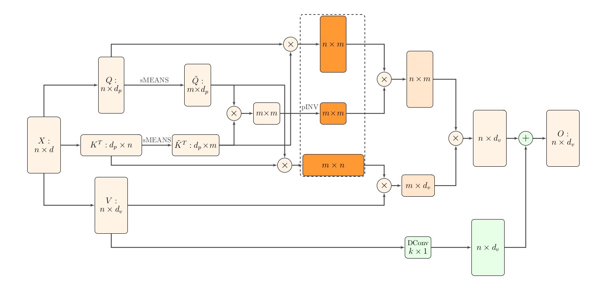

# Nystromformer Description
Nyströmformer: A Nyström-Based Algorithm for Approximating Self-Attention, AAAI 2021

Nystromformer official repository: https://github.com/mlpen/Nystromformer

Nystromformer paper link: https://arxiv.org/pdf/2102.03902v3.pdf

## Motivation

Transformer has O(n^2^) complexity which limits its application to longer sequences. The paper adapts the Nyström method to approximate standard self-attention with O(n) complexity, in the sense of both time and memory.

## Algorithm

### Standard Self-attention

Formally, an input sequence of $n$ tokens of dimensions $d$, $X \in \mathbf{R}^{n \times d}$, is projected using three matrices $W_Q \in \mathbf{R}^{n \times d_q}$, $W_K \in \mathbf{R}^{n \times d_k}$and $W_V \in \mathbf{R}^{n \times d_v}$to extract feature representations $Q$, $K$, and $V$ , referred to as query, key, and value respectively with $d_k = d_q$. The outputs $Q$, $K$, $V$ are computed as $Q = X W_Q$, $K = X W_K$, $V = X W_V$. So self-attention can be written as
$$
D(Q, K, V) = SV = softmax\left(\frac{Q K^T}{\sqrt{d_q}}\right) V
$$
The self-attention mechanism requires calculating n^2^ similarity scores between each pair of tokens, leading to a complexity of O(n^2^) for both
memory and time.

### Nyström Method for Matrix Approximation

Denote the softmax matrix used in self-attention $S = softmax\left(\frac{Q K^T}{\sqrt{d_q}}\right)$ can be written as
$$
S = softmax\left(\frac{Q K^T}{\sqrt{d_q}}\right) = \left[ \begin{array}{1} A_S & B_S \\ F_S & C_S \end{array} \right]
$$
where $A_S \in \mathbf{R}^{m \times m}$, $B_S \in \mathbf{R}^{m \times (n - m)}$, $F_S \in \mathbf{R}^{(n-m) \times m}$ , $C_S \in \mathbf{R}^{(n-m) \times (n-m)}$ . $A_S$ is designated to be the sample matrix by sampling m columns and rows from $S$. $S$ can be approximated via the basic quadrature technique of the Nyström method. By doing singular value decomposition (SVD) on $A_S$, we can get its Moore-Penrose inverse $A_S^+$ and reconstruct the self-attention matrix $S$ as
$$
\hat{S} = \left[ \begin{array}{1} A_S & B_S \\ F_S & F_S A_S^+B_S \end{array} \right] 
= \left[ \begin{array}{1} A_S \\ F_S \end{array} \right] A_S^+ \left[ \begin{array}{1} A_S & B_S \end{array} \right]
$$
$C_S$ is approximated by $F_S A_S^+B_S$. Here, (3) suggests that the n × n matrix $S$ can be reconstructed by sampling m rows $\left[ \begin{array}{1} A_S & B_S \end{array} \right]$ and m columns $\left[ \begin{array}{1} A_S \\ F_S \end{array} \right]$ from S and finding the Nyström approximation $\hat{S}$.

Unfortunately, (3) require calculating all entries in $Q K^T$ , even though the approximation only needs to access a subset of the columns of S. Thus, its complexity is also O(n^2^).

### Linearized Self-Attention via Nyström Method

To avoid calculating all the entries in $Q K^T$ , the basic idea is to use landmarks $\tilde{K}$ and $\tilde{Q}$ from key $K$ and query $Q$. Assuming that $Q = [q_1;q_2;...;q_n]$ and $K = [k_1;k_2;...;k_n]$, Nyströmformer select landmarks simply using Segment-means. As we can pad inputs to a length divisible to m, we assume n is divisible by m for simplicity. Let $l = n / m$ , landmark points are computed as
$$
\tilde{K} = [\tilde{k_1};\tilde{k_2};...;\tilde{k_m}], \space (\tilde{k_j} = \sum_{i=(j-1)l+1}^{(j-1)l+m} \frac{k_i}{m}, \space j=1,2,...,m)
$$

$$
\tilde{Q} = [\tilde{q_1};\tilde{q_2};...;\tilde{q_m}], \space (\tilde{q_j} = \sum_{i=(j-1)l+1}^{(j-1)l+m} \frac{q_i}{m}, \space j=1,2,...,m)
$$

After selecting landmarks, the softmax matrix can be reconstructed as
$$
\hat{S} = softmax\left( \frac{Q \tilde{K}^T}{\sqrt{d_q}} \right) \left( softmax\left( \frac{\tilde{Q} \tilde{K}^T}{\sqrt{d_q}} \right) \right)^+ softmax\left( \frac{\tilde{Q} K^T}{\sqrt{d_q}} \right)
$$
Comparing to (3), the three matrices are represented by landmarks as $\left[ \begin{array}{1} A_S \\ F_S \end{array} \right] = softmax\left( \frac{Q \tilde{K}^T}{\sqrt{d_q}} \right)$, $A_S = softmax\left( \frac{\tilde{Q} \tilde{K}^T}{\sqrt{d_q}} \right)$, $\left[ \begin{array}{1} A_S & B_S \end{array} \right] = softmax\left( \frac{\tilde{Q} K^T}{\sqrt{d_q}} \right)$ respectively. 

To accelerate the computation of Moore-Penrose inverse, Nyströmformer use an iterative method to approximate the Moore-Penrose
inverse via efficient matrix-matrix multiplications. A single iteration is calculated as
$$
Z_{j+1} = \frac{1}{4}Z_j (13I - A_S Z_j (15I - A_S Z_j (7I - A_S Z_j) ) )
$$
and $Z_0$ is chosen by 
$$
Z_0 = \frac{A_S^T}{ ||A_S||_1 \space ||A_S||_{\infty}}, \\
||A_S||_1 = \max\limits_{j} \sum\limits_{i=1}^m |(A_S)_{ij}|, \space ||A_S||_{\infty} = \max\limits_{i} \sum\limits_{j=1}^n |(A_S)_{ij}|
$$
For all the experiments, 6 iterations can achieve a good approximation of the pseudoinverse. Let $A_S^+$ be approximated by $Z^*$ with (7). Nyströmformer approximation can be written as
$$
\hat{S}V = softmax\left( \frac{Q \tilde{K}^T}{\sqrt{d_q}} \right) Z^* softmax\left( \frac{\tilde{Q} K^T}{\sqrt{d_q}} \right) V
$$
The proposed Nyströmformer architecture is shown as

## Complexity

Time complexity: $O(n+m^3 +nm^2 +m n d_v)$

Memory complexity: $O(m d_q + nm + m^2 + m n + n d_v)$ 

When the number of landmarks m << n, the time and memory complexity of Nyströmformer is O(n).

